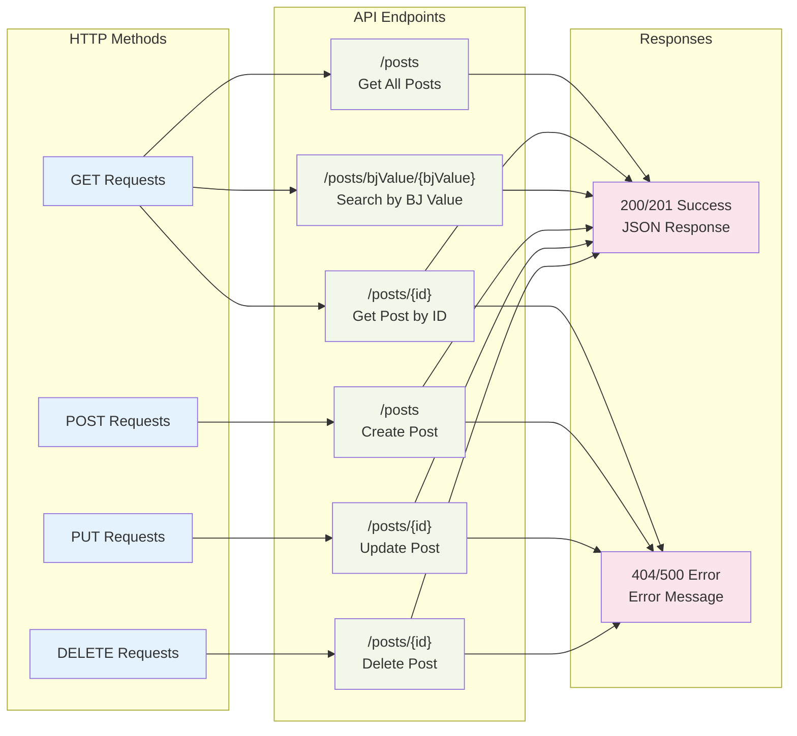

# Spring Boot Post Management System

A comprehensive demo project showcasing Spring Boot REST API development with full CRUD operations, built for learning and demonstration purposes. This application features a complete Post management system with both programmatic API access and an interactive web interface.

## 🏗 System Architecture

```mermaid
graph TB
    subgraph "Client Layer"
        WEB[Web Browser<br/>HTML Interface]
        API[API Client<br/>curl/Postman]
    end
    
    subgraph "Spring Boot Application"
        CTRL[PostController<br/>@RestController]
        SVC[Business Logic<br/>Service Layer]
        REPO[PostRepository<br/>JpaRepository]
    end
    
    subgraph "Data Layer"
        H2[(H2 Database<br/>In-Memory)]
        CONSOLE[H2 Console<br/>Web Interface]
    end
    
    subgraph "Configuration"
        CONFIG[application.properties<br/>Database Config]
        INIT[DatabaseConfig<br/>Sample Data]
    end
    
    WEB -->|HTTP Requests| CTRL
    API -->|REST API Calls| CTRL
    CTRL -->|CRUD Operations| SVC
    SVC -->|Data Access| REPO
    REPO -->|JPA/Hibernate| H2
    CONSOLE -->|Direct Access| H2
    CONFIG -->|Configuration| H2
    INIT -->|Sample Data| REPO
    
    classDef client fill:#e1f5fe
    classDef spring fill:#f3e5f5
    classDef data fill:#e8f5e8
    classDef config fill:#fff3e0
    
    class WEB,API client
    class CTRL,SVC,REPO spring
    class H2,CONSOLE data
    class CONFIG,INIT config
```

## 🚀 Features

- **Full CRUD Operations**: Create, Read, Update, and Delete posts via REST API
- **RESTful API**: Well-structured endpoints with proper HTTP status codes and error handling
- **Interactive Web Interface**: User-friendly HTML interface for managing posts
- **In-Memory Database**: H2 database with pre-loaded sample data
- **Database Console**: Built-in H2 console for direct database access
- **Custom Queries**: Search posts by specific criteria (bjValue)
- **Error Handling**: Comprehensive error responses with meaningful messages
- **Auto-Configuration**: Spring Boot auto-configuration for rapid development

## 🛠 Technology Stack

- **Java 17** - Programming language
- **Spring Boot 3.2.3** - Application framework
- **Spring Web** - REST API development
- **Spring Data JPA** - Data persistence layer
- **H2 Database** - In-memory database
- **Maven** - Build automation and dependency management
- **HTML/CSS/JavaScript** - Frontend interface

## 📋 Prerequisites

- **Java Development Kit (JDK) 17** or higher
- **Maven 3.6+** for build automation
- **Git** (optional, for cloning the repository)

## 🏃‍♂️ Getting Started

### 1. Clone the Repository
```bash
git clone <repository-url>
cd springboot_project
```

### 2. Build the Project
```bash
mvn clean install
```

### 3. Run the Application
```bash
mvn spring-boot:run
```

Or run the JAR file directly:
```bash
java -jar target/demo-0.0.1-SNAPSHOT.jar
```

### 4. Verify Installation
The application will start on **port 8081**. You can verify it's running by:
- Accessing the web interface: http://localhost:8081/generic-interface.html
- Testing the API: http://localhost:8081/posts
- Opening H2 console: http://localhost:8081/h2-console

## 📊 Post Entity Structure

The Post entity contains the following fields:

| Field | Type | Description |
|-------|------|-------------|
| `id` | Long | Auto-generated unique identifier |
| `email` | String | Email address |
| `passcode` | Long | Numeric passcode |
| `active` | Boolean | Active status flag |
| `ecCode` | Long | EC code identifier |
| `bjValue` | String | BJ value for categorization |

### Sample Post JSON:
```json
{
  "id": 1,
  "email": "superman@dc.com",
  "passcode": 12345,
  "active": true,
  "ecCode": 1001,
  "bjValue": "Man of Steel"
}
```

## 🔌 API Documentation

Base URL: `http://localhost:8081`

### API Flow Diagram



### Endpoints Overview

| Method | Endpoint | Description |
|--------|----------|-------------|
| GET | `/posts` | Retrieve all posts |
| GET | `/posts/{id}` | Retrieve post by ID |
| POST | `/posts` | Create a new post |
| PUT | `/posts/{id}` | Update existing post |
| DELETE | `/posts/{id}` | Delete post by ID |
| GET | `/posts/bjValue/{bjValue}` | Search posts by bjValue |

### Detailed API Examples

#### 1. Get All Posts
```bash
curl -X GET http://localhost:8081/posts
```

**Response:**
```json
[
  {
    "id": 1,
    "email": "superman@dc.com",
    "passcode": 12345,
    "active": true,
    "ecCode": 1001,
    "bjValue": "Man of Steel"
  },
  {
    "id": 2,
    "email": "batman@dc.com",
    "passcode": 67890,
    "active": true,
    "ecCode": 1002,
    "bjValue": "Dark Knight"
  }
]
```

#### 2. Get Post by ID
```bash
curl -X GET http://localhost:8081/posts/1
```

**Success Response (200):**
```json
{
  "id": 1,
  "email": "superman@dc.com",
  "passcode": 12345,
  "active": true,
  "ecCode": 1001,
  "bjValue": "Man of Steel"
}
```

**Error Response (404):**
```json
{
  "error": "Error 404 not found",
  "status": "404"
}
```

#### 3. Create New Post
```bash
curl -X POST http://localhost:8081/posts \
  -H "Content-Type: application/json" \
  -d '{
    "email": "flash@dc.com",
    "passcode": 55555,
    "active": true,
    "ecCode": 1004,
    "bjValue": "Fastest Man Alive"
  }'
```

**Success Response (201):**
```json
{
  "message": "Post created successfully",
  "status": "201",
  "data": {
    "id": 4,
    "email": "flash@dc.com",
    "passcode": 55555,
    "active": true,
    "ecCode": 1004,
    "bjValue": "Fastest Man Alive"
  }
}
```

#### 4. Update Post
```bash
curl -X PUT http://localhost:8081/posts/1 \
  -H "Content-Type: application/json" \
  -d '{
    "email": "superman.updated@dc.com",
    "passcode": 99999,
    "active": false,
    "ecCode": 1001,
    "bjValue": "Man of Steel Updated"
  }'
```

#### 5. Delete Post
```bash
curl -X DELETE http://localhost:8081/posts/1
```

**Success Response (200):**
```json
{
  "message": "Post deleted successfully",
  "status": "200"
}
```

#### 6. Search by BJ Value
```bash
curl -X GET http://localhost:8081/posts/bjValue/Dark%20Knight
```

## 🌐 Web Interface

The application includes a user-friendly web interface for managing posts without using command-line tools.

### Accessing the Interface
1. Start the application
2. Open your browser and navigate to: http://localhost:8081/generic-interface.html

### Interface Features
- **Form Fields**: Input fields for all Post entity properties
- **CRUD Operations**: Buttons for all API operations
- **Real-time Results**: JSON responses displayed in a formatted view
- **Search Functionality**: Search posts by BJ Value
- **Responsive Design**: Clean, simple interface

### Using the Interface
1. **Create Post**: Fill in the form fields and click "Create Post"
2. **View All Posts**: Click "Get All Posts" to see all records
3. **Find Specific Post**: Enter an ID and click "Get Post by ID"
4. **Update Post**: Enter ID and new data, then click "Update Post"
5. **Delete Post**: Enter ID and click "Delete Post"
6. **Search**: Enter BJ Value and click "Search by BJ Value"

## 🗄 Database Access

### H2 Console
Access the H2 database console for direct database interaction:

1. **URL**: http://localhost:8081/h2-console
2. **JDBC URL**: `jdbc:h2:mem:testdb`
3. **Username**: `sa`
4. **Password**: (leave empty)

### Sample Data
The application automatically loads sample data on startup:

| ID | Email | Passcode | Active | EC Code | BJ Value |
|----|-------|----------|--------|---------|----------|
| 1 | superman@dc.com | 12345 | true | 1001 | Man of Steel |
| 2 | batman@dc.com | 67890 | true | 1002 | Dark Knight |
| 3 | wonderwoman@dc.com | 11111 | true | 1003 | Amazon Warrior |

### Database Schema
```sql
CREATE TABLE POST (
    ID BIGINT AUTO_INCREMENT PRIMARY KEY,
    EMAIL VARCHAR(255),
    PASSCODE BIGINT,
    ACTIVE BOOLEAN,
    EC_CODE BIGINT,
    BJ_VALUE VARCHAR(255)
);
```

## 📁 Project Structure

```
src/
├── main/
│   ├── java/com/example/demo/
│   │   ├── DemoApplication.java          # Main application class
│   │   ├── config/
│   │   │   └── DatabaseConfig.java       # Database configuration & sample data
│   │   ├── controller/
│   │   │   └── PostController.java       # REST API endpoints
│   │   ├── model/
│   │   │   └── Post.java                 # Post entity definition
│   │   └── repository/
│   │       └── PostRepository.java       # Data access layer
│   └── resources/
│       ├── application.properties        # Application configuration
│       └── static/
│           └── generic-interface.html    # Web interface
└── target/                               # Build output directory
```

## 🔧 Configuration

### Application Properties
Key configurations in [`application.properties`](src/main/resources/application.properties):

```properties
# Server Configuration
server.port=8081

# H2 Database Configuration
spring.datasource.url=jdbc:h2:mem:testdb
spring.datasource.username=sa
spring.datasource.password=

# H2 Console Access
spring.h2.console.enabled=true
spring.h2.console.path=/h2-console

# JPA Configuration
spring.jpa.show-sql=true
spring.jpa.hibernate.ddl-auto=update
```

## 🐛 Troubleshooting

### Common Issues

#### Port Already in Use
If port 8081 is occupied:
1. Change the port in [`application.properties`](src/main/resources/application.properties):
   ```properties
   server.port=8082
   ```
2. Or kill the process using port 8081:
   ```bash
   # Windows
   netstat -ano | findstr :8081
   taskkill /PID <PID> /F
   
   # Linux/Mac
   lsof -ti:8081 | xargs kill -9
   ```

#### Build Failures
1. Ensure Java 17 is installed and configured:
   ```bash
   java -version
   javac -version
   ```
2. Clean and rebuild:
   ```bash
   mvn clean compile
   ```

#### Database Connection Issues
1. Check H2 console access at http://localhost:8081/h2-console
2. Verify JDBC URL: `jdbc:h2:mem:testdb`
3. Restart the application to reset the in-memory database

### Development Tips

1. **API Testing**: Use tools like Postman, curl, or the built-in web interface
2. **Database Inspection**: Use H2 console to view data and execute SQL queries
3. **Logging**: Check console output for SQL queries and error messages
4. **Hot Reload**: Use `mvn spring-boot:run` for automatic restart on code changes

## 📚 Learning Objectives

This project demonstrates:

- **Spring Boot Fundamentals**: Auto-configuration, dependency injection, and starter dependencies
- **REST API Design**: RESTful principles, HTTP methods, and status codes
- **Spring Data JPA**: Repository pattern, entity mapping, and custom queries
- **Error Handling**: Exception handling and meaningful error responses
- **Database Integration**: H2 database configuration and data initialization
- **Web Development**: Static content serving and API consumption
- **Maven Build**: Dependency management and build automation

## 🤝 Contributing

This is a demo project for learning purposes. Feel free to:
- Fork the repository
- Experiment with additional features
- Add new endpoints or functionality
- Improve the web interface
- Add unit tests

## 📄 License

This project is created for educational purposes. Feel free to use it as a reference for learning Spring Boot development.